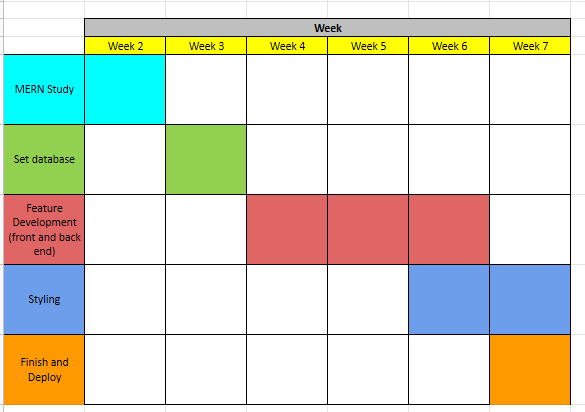
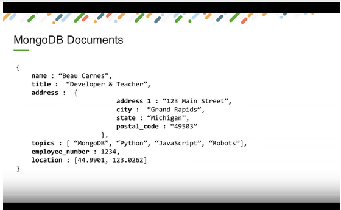
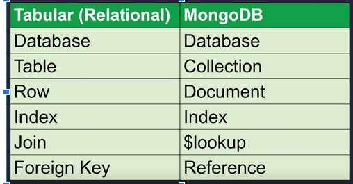

## Project Planning Part 1

### Team Name : Mern Project Team 1

### Team Members :

- Jerrin Eldo Mazhuvancherry
- Diarra
- Nodir
- Bryan
- Will

### Selected Technology or Technologies

- MongoDB 
- Express.JS 
- React JS 
- Node 

### Reasons for choosing this Technology or Technologies

- MongoDB - The only kind of database I am skilled is SQL. I would like to add one more of the backend database to my list of know's. MongoDB is a backend database I have seen in much of the job descriptions in the market. So why not study it.
  
- React JS - This is one of the most exciting front end Javascript libraries available in the market. Front end interfaces are made a lot easier with React.Js, and I would really like to know more about it.
  
- Node &  Express.js - This would be the back end web frameworks used

## Project Planning Part 2

# Project description

- A potential website to view webinars/conferences hosted by an organization. The website will also provide information about the moderators hosting the conferences. The visitors to the website will also have the functionality to review and provide feedbacks for the conferences conducted.
  
# Targeted audience and objective

- Here the conferences are listed which are happening inside the Humber Campuses, and hence we are looking at a scope of the whole Humber Community.
- The objective is to make sure the humber community is well informed on the upcoming conferences/events happening in the Humber Campuses, and they would be able to register for the same as well. 

# Technical considerations (languages, framework, libraries, database, API)

- Javascript and React.js to make the front end UI.
- MongoDB to make the database
  
# List of functionality - for each functionality- who is doing what and brief description

- Login and register functionality, forgot your password etc. Here, we are implementing the login and register functionality for a new user. Users can be admins, visitors and presenters of a conference/webinar - Bryan
  
- Admin can create, read, update, delete PRESENTERS. Here we are listing down all the presenters of the webinar/conference.Admins would have full CRUD operations on the page. - Nodir
  
- User can create, read, update, delete. - WEBINARS/SEMINARS. Here we are listing down all the conferences which are gonna be conducted through the organization.Admins would have CRUD operations on all the Webinars - Diarra
  
- User can create, read, update, delete RATINGS (comments, stars(out of 5), webinar). This is a page where visitors could review the webinars which are already conducted and each webinar would be given a star rating depending on the number of users rated.Admin user would have CRUD operations on all the reviews posted - Jerrin
  
- Subscription email service - Users can subscribe to topics they are interested in. When new webinars are listed within that topic, they will be notified via email subscription. - Will
  
- Admin user can create, read, update, delete subscribers. Admin user can create, update, delete topics. TOPICS - Will

# Time line (Task and schedule) 

# Project Phase 2 - Part 1

## Learning Path and Learning Resources
  
### Tutorials following :

- A sample restaurant reviews website to study how the MERN stack works - https://www.youtube.com/watch?v=mrHNSanmqQ4&t=3940s (MERN stack Full course)
- A sample exercise application to study how the MERN stack works with models in the backend - https://www.youtube.com/watch?v=7CqJlxBYj-M&t=1522s (MERN Stack in 2 hrs)
- A crash course on how mongodb works - https://www.youtube.com/watch?v=-56x56UppqQ
  
## Setup development environment and IDE

- Installed MongoDB and  Created an account with MongoDB.

## Hello World example

- Did the hello world example

# Project Phase 2 - Part 2

## Weekly Task List
  
### Task List

- Learn how the MERN stack works and setup a sample database with mongodb
  
### Task Status

- Installed mongodb and worked with a sample restaurants collection.
  
### Learning Curve and challengers 
  
## Learning Notes

### What is MongoDB

- stores data in Binary JSON format.

- Document model also allows storing sub documents.
- Data that is accessed together is stored together.
- Difference between relational and Mondb databases

- MongoDb is case sensitive

### How to install mongodb

- Open cmd in administrator mode
- net start MongoDB
- C:\Program Files\MongoDB\Server\4.4\bin\mongo.exe"
- net stop MongoDB

### Queries in MongoDb

-  show dbs - shows all the databases
- use mydatabase - use the database specified
- show collections
- db.createCollection(‘people’)
- db.people.insert({"name":"Jane Doe","age":"30","country":"France"})
- db.people.insert({"name":"John Smith","age":"50","_id":"123"})
- db.people.insertMany([{"name":"Mary","age":20},{"name":"Berlin","age":30},{"name":"Jane"}])
- db.people.find().pretty()
- To insert data into a collection : 

- db.posts.insert({ 
title : 'Post One', 
body:'Body of post one',
category:'News',
Likes:4,
Tags:['news','events'],
user:{name:'John Doe',status:'author'},
date: Date()
})
- Use acme - switch to the database acme
- db.dropDatabase() - to delete a database , make sure your in the correct directory after making use of the ‘use’ statement
- db.people.insertMany([{"name":"Mary","age":20},{"name":"Berlin","age":30},{"name":"Jane"}]) - Insert many rows at once
- db.people.find() - to find all the data
- db.people.find({ name: "Mary"}) - find all objects where name is equal to Mary
- db.people.find().sort({age : 1}).pretty() - Sort ascending based on age
- db.people.find().sort({age : -1}).pretty() - Sort descending based on age
- db.people.find().count() - to return the count
- db.people.find().limit(2) - we could limit the number of rows returned as well
- db.people.find().sort({age:1}).limit(2).pretty()
- db.people.find().forEach(function(doc){ print('Blog Post:' + doc.age)})
-  db.people.findOne({ age: 20}) - finds the row with age 20
-  db.people.update({ name : 'Mary'}, {name : 'Mary',age: 22},{upsert:true}) - updates the data for a field with ‘Mary’ , if its not there in the database , it will insert the data anyway.
- db.posts.update({ title:'Post One'},
{
    $set:{
        body:'Body of Post 2',
        category:'Technology'
    }
}
) -  Update a collection
- db.posts.update({ title : 'Post One'},{ $inc : {likes:2}}) - Increment a field in the collection
- db.posts.remove({ title : 'Post One' }) - Remove a post
- db.posts.update({ title : 'Post One'},
    {
        $set : {
            comments: [
                {
                    user: 'Mary Williams',
                    body: 'Comment one',
                    date: Date()
                },
                {
                    user: 'Harry White',
                    body: 'Comment two',
                    date: Date()
                }
            ]
        }
    }
) -  To insert an array of fields on a collection
- db.posts.find({
    comments:{
        $elemMatch: {
            user: 'Mary Williams'
        }
    }
}) - To search within an array inside a field
- db.posts.find( { views : { $gt:8} } ).pretty() -  Greater Than ( We can also use gte , lt & lte
)

# Project Phase 3

## Weekly Task List

### Task List

- Setting up the backend for the Workshop project by making a sample codebase based on the tutorials.
  
### Task Status

- Made a sample application with MongoDb as the database
  
### Learning Curve and challengers

## Learning Notes

- https://github.com/jerrineldo/restaurantreviews
  
### Learning Resources

- https://www.youtube.com/watch?v=mrHNSanmqQ4&t=3940s

# Project Phase 4

## Weekly Task List

### Task List

- Setting up the backend and front end for the Workshop project by making a sample codebase based on the tutorials.
- Setting up the backend and front end codebases for a restaurant review website
- Setting up the backend and front end codebases for an exercise website
  
### Task Status

- Made a sample application for listing out a set of restaurants with MongoDb as the database
- Made an exercise tracker website with embedded models using mongoose.
### Learning Curve and challengers

## Learning Notes

- https://github.com/jerrineldo/restaurantreviews
- https://github.com/jerrineldo/exercisetracker
  
### Learning Resources

- https://www.youtube.com/watch?v=mrHNSanmqQ4&t=3940s
- https://www.youtube.com/watch?v=7CqJlxBYj-M&t=1522s
